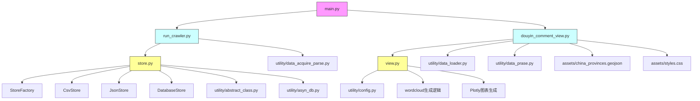

# 抖音评论数据可视化

## 数据获取

## 数据分析

## 数据可视化

## 项目框架

1. 入口文件main.py协调整个流程
2. 爬虫模块run_crawler.py负责数据采集和存储
3. 可视化模块douyin_comment_view.py负责数据分析展示
存储系统store.py提供多种存储方式
view.py包含所有可视化图表生成逻辑
6. utility包包含数据处理、配置等工具函数
7. assets包含地理数据和样式资源
箭头表示模块间的依赖调用关系，黄色背景的是核心功能模块，青色背景的是主要流程控制器，粉色背景的是程序入口。
