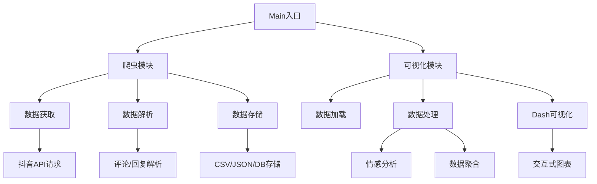
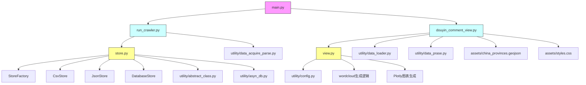
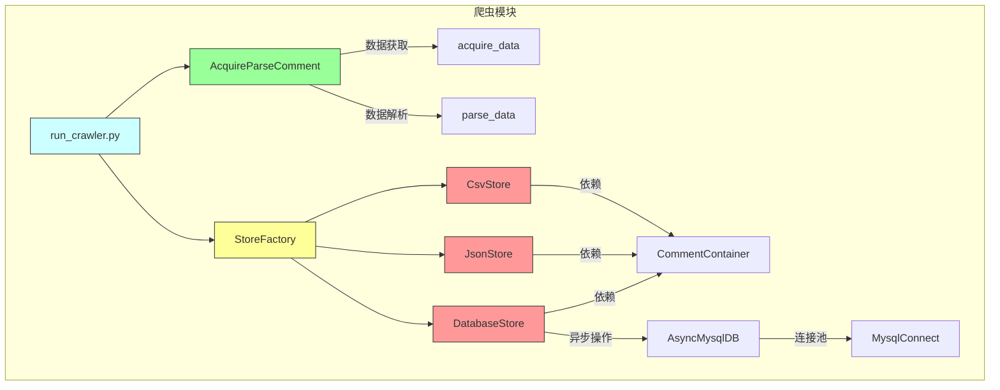
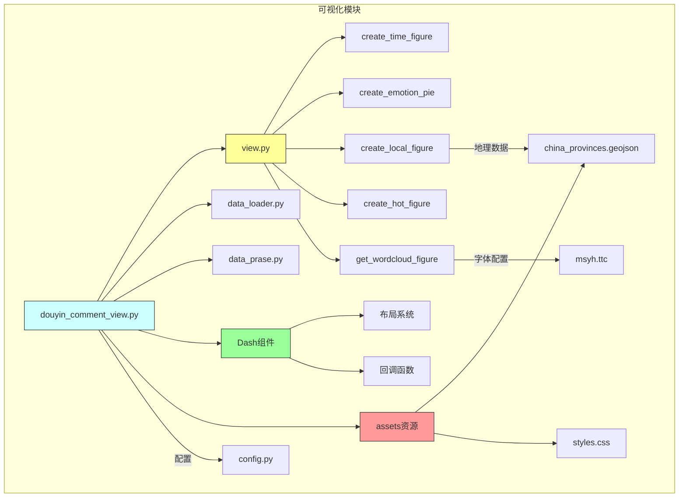
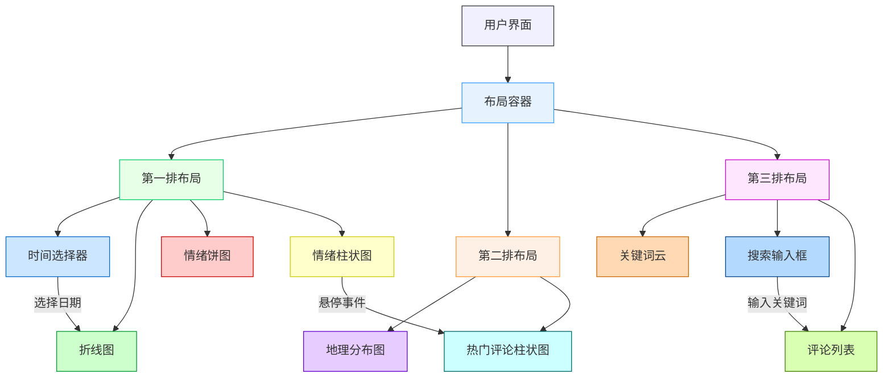

# 抖音评论数据可视化

## 项目框架

主要模块关系说明：

1. 入口文件main.py协调整个流程
2. 爬虫模块run_crawler.py负责数据采集和存储
3. 可视化模块douyin_comment_view.py负责数据分析展示
4. 存储系统store.py提供多种存储方式
5. view.py包含所有可视化图表生成逻辑
6. utility包包含数据处理、配置等工具函数
7. assets包含地理数据和样式资源
箭头表示模块间的依赖调用关系，黄色背景的是核心功能模块，青色背景的是主要流程控制器，粉色背景的是程序入口。

## 爬虫框架

## 可视化框架

模块结构说明：

1. 爬虫模块：

- 核心控制器：run_crawler.py
- 数据获取解析：AcquireParseComment类实现API请求和响应解析
- 存储系统：工厂模式支持CSV/JSON/DB三种存储方式
- 数据容器：CommentContainer统一数据结构
- 数据库连接：通过AsyncMysqlDB实现异步操作

2. 可视化模块：

- 主控制器：douyin_comment_view.py
- 图表引擎：view.py包含5种可视化图表生成器
- Dash框架：实现交互式Web仪表盘
- 数据处理：data_loader和data_prase进行数据清洗
- 资源依赖：地理数据、样式表、中文字体等
- 配置系统：config.py管理API密钥等参数

箭头表示数据流向和依赖关系，绿色背景的是数据处理组件，黄色背景的是核心逻辑，红色背景的是基础设施组件。

### 页面布局

